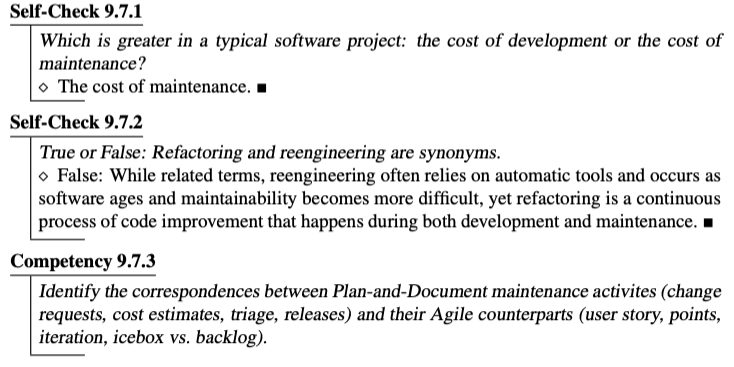

# PrairieLearn: Practice Problems, Competency Questions, Quizzes, Exams

As of 2021, we’ve moved all summative assessments (quizzes/exams) and all non-CHIPS formative assessments (practice problems, practice questions not involving code-writing) to use the [PrairieLearn](https://prairielearn.org) (PL) assessment authoring system. Besides allowing us to create rich interactive exercises, PL allows randomizing elements of the questions, making them suitable for summative assessments as well as practice.

PL is open source and you can download and run it yourself (not trivial), or contact the nice folks at [PrairieLearn.com](https://prairielearn.com) to host it for you; they will usually offer a free trial period so you can try out the system for a semester before using it. **Disclaimer:** While we love PrairieLearn, we have no formal connection to PL so you'll need to contact them directly for support (except, of course, for bugs in the ESaaS questions themselves).

## How to get the ESaaS PrairieLearn content

See below for how PL organizes content for a course. In short, you'll need a GitHub repo representing your course, which you'll populate with questions and assessments. If you're getting your free trial from PrairieLearn.com, there's a "request course creation" button on their site that creates a repo there. If you're running PrairieLearn yourself (you'll need to get your IT folks involved here), you'll create a GitHub repo that you own from which you'll publish your course.

In either case, you have a couple of ways to get access:

1. To preview the questions as a student would see them, PrairieLearn has a _question sharing_ feature  we can use. A subset of the questions in our question bank are linked from the textbook as _competencies_; email Armando for a document containing links from each Competency
2. Email  Armando for a Zipfile that you can unpack that includes _most_ of our PL questions. (Our repo includes at least some questions we'd like to keep private so they don't escape into the wild, and a few files containing Berkeley-specific information, so we extract a subset of the questions to send you.) Note that the PrairieLearn question format isn't particularly amenable to generating printed quizzes, so if that is your goal, you might find it easier to preview the questions above and adapt them as you see fit.

## Competency questions from textbook

The textbook has been augmented with competencies at the end of each section, and a subset of these are linked to PrairieLearn questions that test the competency. You and your students can preview the questions—that is, attempt to answer them and get the autograder feedback—for free using the PrairieLearn _question sharing_ feature, for which all you need is the "magic sharing link" for each question. Email Armando to get a document of these links. (Note that this relies on security-through-obscurity: any student who has the link can access the questions and autograder.)

## Overview of ESaaS Content in PL

The `questions/` subdirectory in the PL archive contains questions organized by chapter of the textbook. There are 3 broad categories of question types:

1. "Simple" questions that could be made to work with other (non-PL) platforms, such as:
   * multiple-choice or select-all-that-apply questions. In a few cases, the answer choices will be randomized in the sense that the choices displayed to the student (both the correct answer(s) and distractors) are drawn from a longer list of correct answers and distractors.
   * “Put these steps in order” questions, in which the students drag-and-drop a set of steps into a correct partial or total order. In a few cases, the steps shown will be a subset drawn from a longer list of possible steps (and distractors).
   * Short-answer/fill-in-blank/numeric answer questions, in which the answer must match a regular expression or fall within a numeric error of a correct answer. In a few cases, the specific numeric or string parameters in the question will be randomized.
2. **Practice questions** for topics such as constructing and parsing routes, writing regular expressions, and so on. Many of these questions feature randomization_._ For example, a question on database joins and Cartesian products will generate a set of random-but-plausible data constructed from a large corpus of real data each time the question is repeated. These could in principle be used on exams or quizzes to take advantage of the randomization, but are also excellent for practice.
3. **“Artisan” exam questions** that are more involved and appropriate for longer exams, but have little or no randomization.

## Connecting questions to competencies

Starting with book version 2.0b9, the end of each subsection in the book includes one or more Self-Checks, for the student to verify that they understood the main points of the section, and sometimes one or more Competencies, specific skills that the student should be able to demonstrate. Here is an example from the end of section 9.7, comparing the maintenance processes for plan-and-document projects vs. agile projects:

<figure><figcaption>
Unlike the self-checks, most of the Competencies are linked to PrairieLearn questions.
</figcaption></figure>

The difference is that most Competencies have an associated question in the question bank, either in PrairieLearn format or in the form of an open-ended question. The file `competencies_map.<bookversion>.html` at the top level of the PL archive maps a subset of the competencies listed in the book to one or more PL question IDs (QIDs) that check that competency. We don't claim that the given questions are an exhaustive test of the competency, but it's somewhere to start to make sure you're getting the coverage you want on your summative assessments.

Some of these questions are particularly well suited to "skills building" because there's enough randomness that students can generate many question instances and get instant feedback while practicing the skill repeatedly. For example, the questions on regular expressions are like this. Using the PL UI, search for questions tagged "practice" to find more of these.

## Per-Chapter Quizzes in PL

In the directory `courseInstances/TEMPLATE/assessments`, you'll find subdirectories `ModuleQuiz01`, etc. each of which contains a collection of suggested questions for reviewing that chapter grouped into an `infoAssessment.json` file. These are only suggestions!
