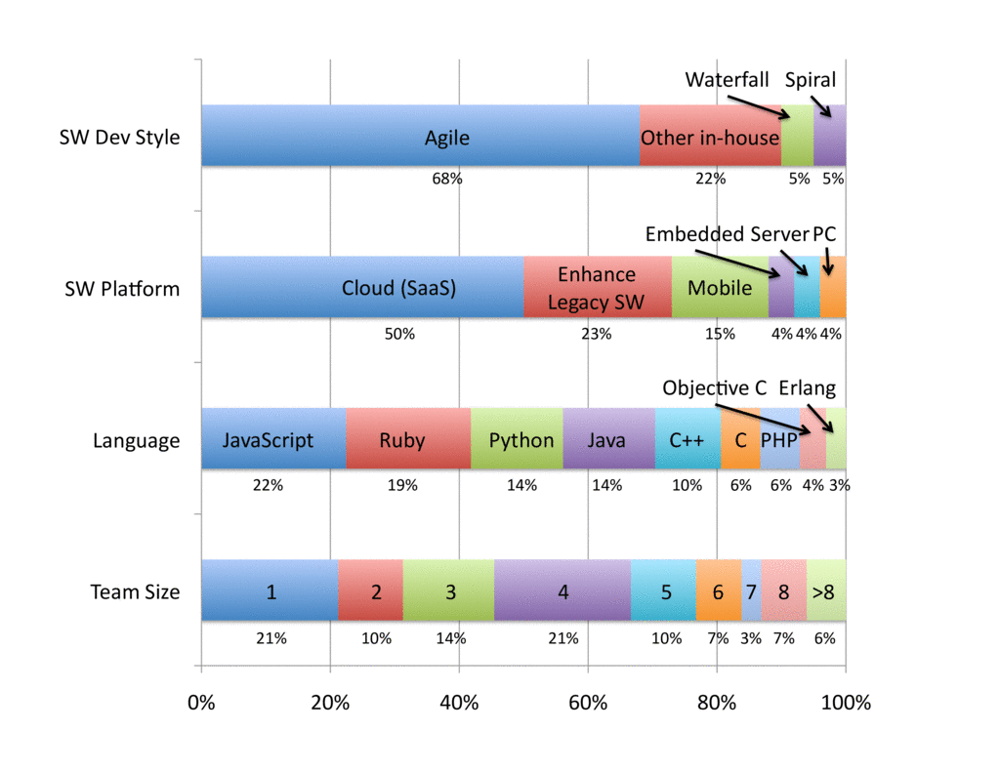
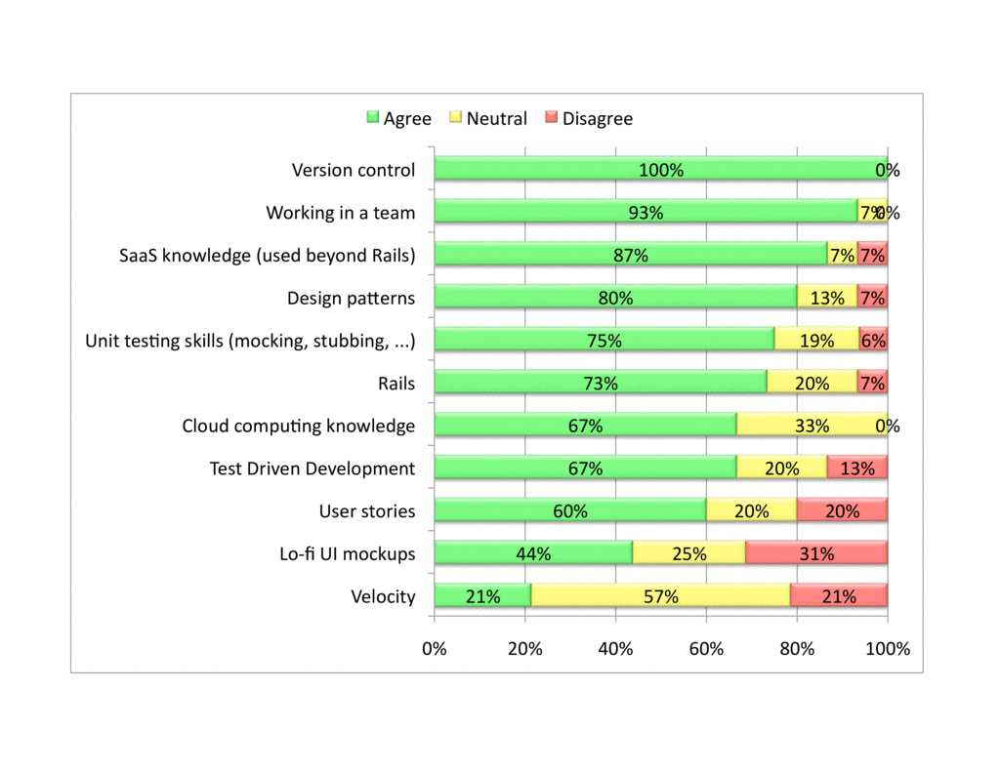

# Classroom & Student Experience

The productivity afforded by the tools and services used in the course allows college students to experience the whole software life cycle repeatedly in a single course. A typical Berkeley undergraduate workload of four courses per term and a 50-hour work week gives students about 12 hours total per week per course, including lectures, labs, exams, and so forth. This works out to roughly 120 hours per quarter to 180 hours per semester, or just three to four weeks for a full-time developer! The productivity of Rails and its ecosystem of tools and the automation of tasks via services allow students to learn and practice software engineering fundamentals within the time budget of the classroom.

### Survey of Berkeley Alumni in Industry Activities

In 2014, shortly after adopting the book, we emailed a small sample of Berkeley undergraduates across two offerings of the course who were now working in the software industry. We wanted to know what development methodologies they were using, what software platform (cloud, shrinkwrapped software, etc.), what language(s), and the sizes of the teams they were in, if any. The following figure summarizes the responses. Just 22 of the 47 respondents had graduated, and just 19 had done significant software projects. The figures below show the results of their 26 software projects. We were surprised that Agile software development was so popular (68%) and that the cloud was such a popular platform (50%). Given that no language was used in more than 22% of the projects, our alumni must be using Agile in projects that use languages other than Ruby or Python. All the class teams had four or five students, which happily matches the average team size from the survey.

The next figure shows these same students' ranking of the topics in the book in terms of usefulness in their industrial projects. Most students agreed that the concepts in the course were useful in their jobs. Once again, we were pleased to see that these ideas were still being used, even in industrial projects that did not rely on Agile or on Rails. The two lower ranked topics were Lo-Fi User Interface Mockups, which makes sense since few developers work on the UI of a user-facing project, and Velocity, as progress can be measured in other ways in industry.

Although a small sample and not a conclusive user study, we think our survey offers at least anecdotal evidence that people who study this material continue to use successful software development techniques in later software projects of all kinds.

### Conclusion: Perspectives on Course from Three Sets of Stakeholders

Overall, our experience has been that all three stakeholders have enjoyed using the material:

* Students like it because they get the pride of accomplishment in shipping code that works and is used by people other than their instructors, plus they get experience that can help land internships or jobs.
* Instructors like it because students actually use what they hear in lecture, they can see how big computer science ideas genuinely improve productivity, and they use what they learn beyond the classroom. They also enjoy that the testing and code evaluation tools of Rails can help automatically grade interesting programming assignments. Autograding enables teaching the Agile lifecycle in a , thereby allowing thousands of students to learn the material at once.
* Colleagues in industry like it because it addresses several of their concerns. An example is this quote from a Google manager:

> I'd be far more likely to prefer graduates of this program than any other I've seen. As you know, we're not a Ruby shop, but I feel this is a good choice for the class to be able to get real features done. Java or C++ would take forever.
